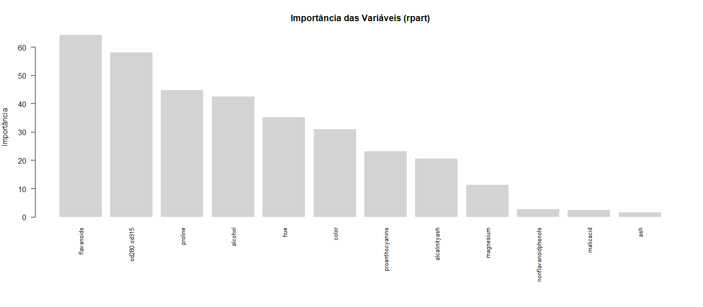
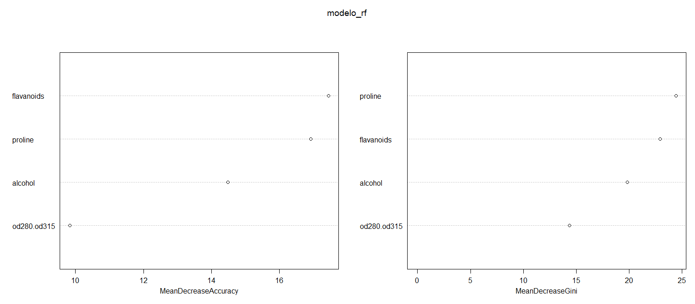
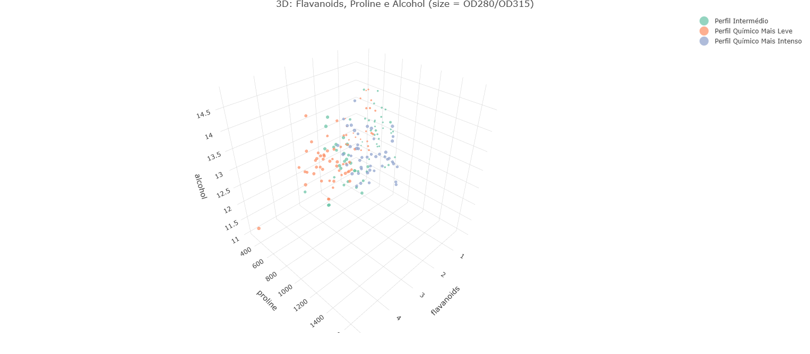
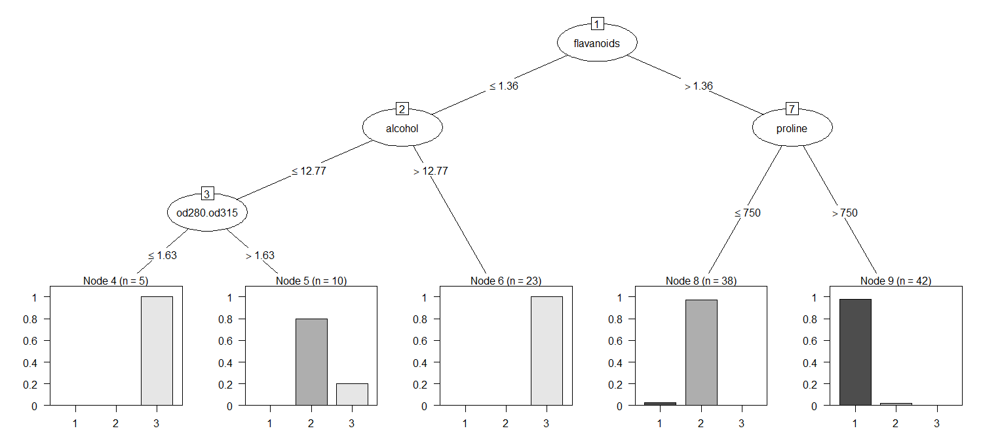
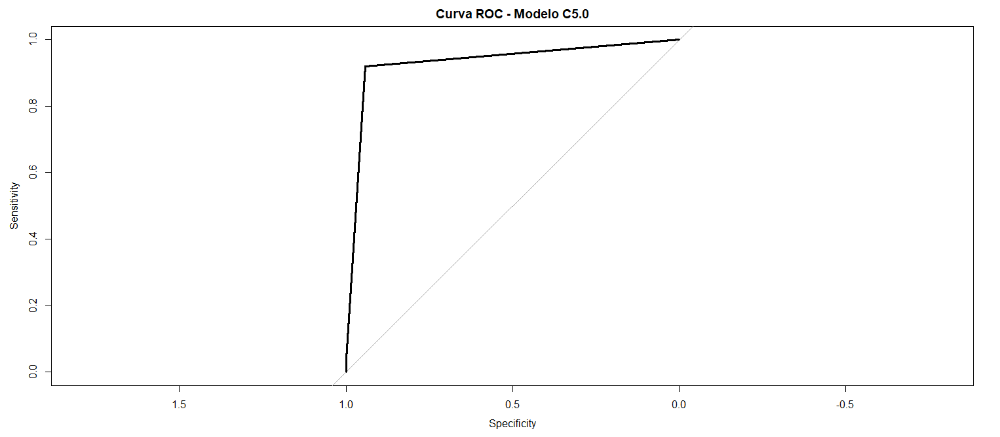

# Wine Chemical Analysis & Classification (R) 🍷🧪

This project focuses on the chemical characterization and predictive modeling of wine cultivars using the **R programming language**. Developed as a final project for the Data Analyst program at Cesae Digital.

## 🎯 Business & Enological Objective
The study aims to identify which chemical compounds (Flavanoids, Proline, Alcohol, etc.) are the most significant markers for distinguishing between different wine cultivars. This has direct applications in quality control and authenticity verification in the wine industry.

## 🛠️ Data Science Pipeline
- **Exploratory Data Analysis (EDA):** Correlation matrix analysis and handling missing values.
- **Variable Importance:** Used `rpart` and `Random Forest` to identify that **Flavanoids** and **Proline** are the primary discriminators.
- **Unsupervised Learning:** Applied **K-Means Clustering** (k=3) to group wines by chemical profiles (Light vs. Intense profiles).
- **Supervised Learning:** - **Decision Trees (C5.0):** Achieved an impressive **AUC of 0.93**.
  - **Random Forest:** Achieved **~92% accuracy** in the test set.
- **Advanced Visualization:** 2D/3D interactive plots using `ggplot2` and `plotly`.

## 📈 Key Insights
- **Flavanoids** were identified as the most relevant variable, reflecting structural chemical differences between cultivars.
- The **OD280/OD315** index strongly contributes to discrimination due to its relationship with phenols and sensory quality.
- The models proved highly viable for automated wine classification with near-perfect accuracy.

## 🧰 Tech Stack (R Libraries)
- `ggplot2` & `plotly` (Visualization)
- `rpart` & `randomForest` (Machine Learning)
- `C50` & `pROC` (Classification & Metrics)
- `reshape2` & `cluster` (Data Manipulation)

## 📊 Visualizações e Resultados Técnicos

### 1. Identificação de Marcadores Enológicos (Feature Importance)
Utilizei os modelos **rpart** e **Random Forest** para validar quais compostos químicos são os principais discriminadores entre os cultivares de vinho. **Flavanoids** e **Proline** surgiram como os indicadores mais fortes.

  
  

### 2. Segmentação de Perfis Químicos (Clustering)
Apliquei o algoritmo **K-Means (k=3)** para agrupar os vinhos. A visualização 3D abaixo demonstra a separação clara entre os perfis: *Intermédio, Químico Leve e Químico Intenso*.

### 3. Modelo de Classificação e Performance
A **Árvore de Decisão (C5.0)** revelou as regras lógicas de separação, enquanto a **Curva ROC** confirmou a alta precisão do modelo, com um **AUC de 0.93**.

  

